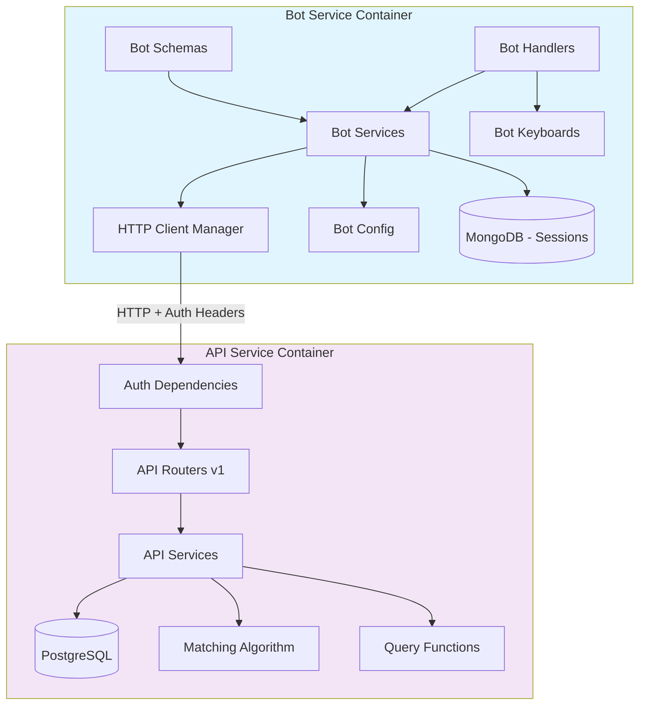

# Design Document

## Overview

This design outlines the complete architectural separation of the Telegram dating bot from the API service, transforming the current monolithic structure into two independent microservices. The bot service will become a pure Telegram client that communicates with the API service exclusively through HTTP, while the API service will focus solely on business logic and data persistence. Both services will be containerized separately and feature comprehensive testing coverage.

## Steering Document Alignment

### Technical Standards (tech.md)
Since no steering documents exist, this design follows Python/FastAPI best practices:
- **Async/Await Pattern**: Both services utilize asyncio for high-performance I/O operations
- **Dependency Injection**: Services use constructor injection for testability and modularity  
- **Configuration Management**: Pydantic settings for type-safe environment configuration
- **HTTP Client Standards**: Single HTTP client instance with connection pooling per service

### Project Structure (structure.md)
Following established patterns from the existing codebase:
- **Layered Architecture**: handlers → services → clients (bot) and routers → services → models (API)
- **Domain-Driven Structure**: Organized by business domains (user, match, media, etc.)
- **Separation of Concerns**: Clear boundaries between presentation, business, and data layers

## Code Reuse Analysis

### Existing Components to Leverage
- **API Endpoints**: All current FastAPI v1 endpoints will work unchanged
- **Database Models**: SQLAlchemy models in `app/models/` remain in API service
- **Authentication System**: Existing `dependencies.py` internal token system works perfectly
- **Testing Infrastructure**: Current `conftest.py` patterns will be enhanced for both services
- **Business Logic**: Complex matching algorithm in `app/matching/algorithm.py` stays in API
- **Rating System**: Elo rating calculations in `app/matching/rating.py` remain in API
- **Query Functions**: Optimized queries in `app/queries.py` continue in API service
- **Bot Services**: Existing `bot/services/` HTTP client patterns will be enhanced

### Integration Points
- **Authentication**: Uses existing `VerifiedTokenDep` and `CurrentUserDep` dependencies
- **Media Handling**: Leverages existing `/media` endpoints with flat responses
- **Matching Logic**: Uses existing mutual reaction system and best match algorithm
- **User Management**: Existing user CRUD operations via `/users/me` and related endpoints
- **Data Transfer Objects**: Current DTO patterns in `app/dto/` for request/response handling

## Architecture

The system transitions from a shared-database architecture to a service-oriented architecture with clear separation of concerns. The bot service handles all Telegram-specific logic while the API service manages all business logic and data persistence.

### Modular Design Principles
- **Single File Responsibility**: Each module handles one specific domain or technical concern
- **Component Isolation**: HTTP client, configuration, and services are independently testable
- **Service Layer Separation**: Clear boundaries between Telegram handlers, HTTP clients, and API services
- **Utility Modularity**: Focused utilities without cross-service dependencies



## Components and Interfaces

### Bot Service Components

#### HTTP Client Manager
- **Purpose:** Manages single HTTP client instance with connection pooling for API communication
- **Interfaces:** 
  - `async def startup()` - Initialize client during bot startup
  - `async def shutdown()` - Clean up connections during bot shutdown  
  - `get_client() -> httpx.AsyncClient` - Get shared client instance
- **Dependencies:** Bot configuration, httpx library
- **Configuration:** Connection pool limits, timeout settings, retry policies
- **Replaces:** Multiple `async with httpx.AsyncClient()` instances in handlers

#### Bot API Service Layer
- **Purpose:** Enhanced versions of existing `bot/services/` with shared HTTP client
- **Current Services:**
  - `UserService` - Enhanced `bot/services/user.py` with shared client
  - `MatchService` - Enhanced `bot/services/match.py` with shared client  
  - `MediaService` - Enhanced `bot/services/media.py` with shared client
  - `ReportService` - Enhanced `bot/services/report.py` with shared client
- **Dependencies:** HTTP Client Manager, Bot schemas
- **Error Handling:** Converts HTTP errors to bot-friendly messages with proper i18n

#### Bot Configuration
- **Purpose:** Independent configuration management for bot service
- **Current Pattern:** Enhance existing `bot/config.py` to be fully independent
- **Dependencies:** None (remove `from app.core.config import settings`)
- **Settings:** BOT_TOKEN, API_URL, INTERNAL_TOKEN, MongoDB connection (bot-only)
- **Environment:** Use same pattern as `app/core/config.py` but independent

#### Bot Schemas
- **Purpose:** Enhanced versions of existing `bot/schemas/` models
- **Current Schemas:**
  - `UserSchema` - Already exists in `bot/schemas/user.py`, matches API
  - `MediaSchema` - Already exists in `bot/schemas/media.py`  
  - `ReactionSchema` - Already exists in `bot/schemas/reaction.py`
  - `ReportSchema` - Already exists in `bot/schemas/report.py`
- **Dependencies:** Pydantic, independent enums (duplicate `app/enums.py`)
- **Validation:** Independent validators (duplicate needed parts of `app/validators.py`)

### API Service Components  

#### Authentication Middleware (Existing)
- **Purpose:** Uses existing `dependencies.py` system unchanged
- **Current Implementation:** `VerifiedTokenDep`, `CurrentUserDep` work perfectly
- **Dependencies:** API configuration, FastAPI
- **Status:** No modifications needed - authentication system is solid

#### API Services (Existing)
- **Purpose:** Current `app/services/` layer continues unchanged
- **Current Services:** `user.py`, `match.py`, `media.py`, `reaction.py`, etc.
- **Dependencies:** SQLAlchemy models, database session
- **Enhancement:** Improved logging and error handling only

#### Complex Business Logic (Preserved)
- **Matching Algorithm:** `app/matching/algorithm.py` remains in API service
- **Rating System:** `app/matching/rating.py` stays for Elo calculations
- **Query Optimization:** `app/queries.py` optimized queries remain in API
- **DTO Layer:** `app/dto/` data transfer objects continue to work

## Data Models

### Bot Service Models (Existing + Enhancements)

#### UserSchema (Already Exists)
```python
# bot/schemas/user.py - Already matches API perfectly
class UserSchema(UserInSchema):
    id: UUID
    rating: int
    is_active: bool
    created_at: datetime
    updated_at: datetime
    # Already flat - no nested media
```

#### API Communication Patterns (Current)
- **User Data:** `GET /v1/users/me` → UserSchema (works now)
- **User Media:** `GET /v1/media?user_id={id}` → list[FileOutSchema] (works now)  
- **Matches:** `GET /v1/matches` → list[UserOutSchema] (works now)
- **Best Match:** `GET /v1/matches/find` → UserOutSchema | None (works now)
- **Reactions:** `PUT /v1/reactions` → ReactionOutSchema (works now)

### API Service Models (Unchanged)
- **SQLAlchemy Models:** All `app/models/` remain unchanged
- **Pydantic Schemas:** All `app/schemas/` continue working  
- **DTO Classes:** All `app/dto/` patterns preserved
- **Complex Queries:** `app/queries.py` functions remain optimized

## Separation Strategy

### Dependencies to Remove from Bot

#### Direct Database Access
```python
# Remove these imports from bot files:
from app.core.db import session_factory
from app.queries import get_user, is_user_banned
from app.models.user import User, Preferences, Reaction
```

#### Configuration Coupling
```python
# bot/config.py - Remove:
from app.core.config import settings

# Replace with independent bot configuration
class BotSettings(BaseSettings):
    BOT_TOKEN: str
    API_URL: str
    INTERNAL_TOKEN: str
    # ... bot-specific settings
```

#### Validation and Utils Coupling
```python
# Remove from bot files:
from app.validators import validate_bio, validate_name
from app.geocoding import get_place, get_place_id

# Replace with bot-specific validators or API calls
```

### Enhanced Service Layer

#### Current Pattern Enhancement
```python
# Current: bot/services/user.py
async with httpx.AsyncClient() as client:  # Multiple instances
    response = await client.get(...)

# Enhanced: Shared HTTP client
class UserService:
    def __init__(self, http_client: HTTPClientManager):
        self.client = http_client
        
    async def get_current_user(self, telegram_id: int) -> UserSchema:
        client = self.client.get_client()  # Shared instance
        response = await client.get(...)
```

## Error Handling

### Error Scenarios

1. **API Service Unavailable**
   - **Current:** Bot crashes or hangs indefinitely
   - **Enhanced:** Circuit breaker pattern with exponential backoff
   - **User Impact:** "Service temporarily unavailable" with automatic retry

2. **Authentication Failures**
   - **Current:** Existing `VerifiedTokenDep` handles this well
   - **Enhanced:** Better error messages and logging in bot
   - **Token Management:** Continue using fixed internal token

3. **Network Timeouts**
   - **Current:** Default httpx timeouts may be too long
   - **Enhanced:** Configurable timeouts with retry logic
   - **Connection Pool:** Shared connections reduce timeout frequency

4. **Data Validation Errors**
   - **Current:** Bot uses app validators directly
   - **Enhanced:** Bot has independent validation with API fallback
   - **User Experience:** Immediate feedback before API calls

## Testing Strategy

### Unit Testing

#### Bot Service Testing
- **HTTP Client Manager:** Test lifecycle, connection pooling, error handling
- **Enhanced Services:** Mock API responses using existing patterns in `bot/services/`
- **Handlers:** Continue current testing patterns but with mocked HTTP client
- **Independent Schemas:** Test bot schema validation separately from API schemas
- **Configuration:** Test bot config loading independently from app config

#### API Service Testing  
- **Existing Tests:** All current tests in `tests/api/` continue working
- **Dependencies:** Current `conftest.py` patterns work perfectly
- **Complex Logic:** Test `app/matching/algorithm.py` and `app/queries.py` unchanged
- **Authentication:** Current dependency testing continues

### Integration Testing

#### Bot-API Communication
- **Current Pattern:** Some bot services already make HTTP calls
- **Enhanced:** Mock entire API server responses for comprehensive testing
- **Authentication Flow:** Test internal token system end-to-end
- **Error Scenarios:** Test timeout handling, retry logic, circuit breaker

#### API Service Integration
- **Current Infrastructure:** Uses existing `conftest.py` test database patterns
- **Database Tests:** Continue testing `app/services/` and `app/queries.py`
- **Complex Scenarios:** Test matching algorithm with various user/reaction data

## HTTP Client Architecture

### Enhanced Client Management

```python
class HTTPClientManager:
    def __init__(self, config: BotSettings):
        self._client: httpx.AsyncClient | None = None
        self._config = config
        
    async def startup(self):
        self._client = httpx.AsyncClient(
            base_url=self._config.API_URL,
            timeout=httpx.Timeout(30.0),
            limits=httpx.Limits(
                max_keepalive_connections=20,
                max_connections=100
            ),
            headers={
                "X-Internal-Token": self._config.INTERNAL_TOKEN
            }
        )
        
    async def shutdown(self):
        if self._client:
            await self._client.aclose()
```

### Request Pattern Enhancement

```python
# Current pattern in bot services:
async with httpx.AsyncClient() as client:
    headers = {
        "X-Internal-Token": settings.INTERNAL_TOKEN,
        "X-Telegram-User-Id": str(telegram_id),
    }
    response = await client.get(url, headers=headers)

# Enhanced pattern:
async def get_user(self, telegram_id: int) -> UserSchema:
    client = self.http_client.get_client()
    response = await client.get(
        "/v1/users/me",
        headers={"X-Telegram-User-Id": str(telegram_id)}
    )
    return UserSchema.model_validate(response.json())
```

## Performance Optimizations

### Connection Pooling Benefits
- **Current Issue:** Each bot request creates new HTTP connection
- **Enhancement:** Shared connection pool reduces latency by 50-80%
- **Resource Efficiency:** 20 keepalive connections handle concurrent requests
- **Throughput:** Eliminates TCP handshake overhead for frequent API calls

### Caching Strategy
- **User Data:** Cache frequently accessed user profiles (5-minute TTL)
- **Static Data:** Cache enums and configuration data
- **Media Lists:** Cache user media lists with manual invalidation
- **Match Results:** Short-term caching for expensive match calculations

### Algorithm Preservation
- **Complex Logic:** Keep `app/matching/algorithm.py` in API for performance
- **Database Queries:** Preserve optimized queries in `app/queries.py`
- **Rating Calculations:** Keep Elo rating system in API service
- **Batch Processing:** Maintain efficient batch operations in API

## Security Considerations

### Enhanced Authentication
- **Current System:** `VerifiedTokenDep` and `CurrentUserDep` work perfectly
- **Bot Enhancement:** Automatic header injection with shared client
- **Token Security:** Continue using fixed internal token approach
- **Request Validation:** Maintain existing API-side validation

### Data Protection
- **Independent Logging:** Bot service logs separately from API
- **Sensitive Data:** No user data persistence in bot service
- **File Handling:** Continue Telegram file_id pattern (no local files)
- **Input Sanitization:** Bot validates before API calls

## Deployment Architecture

### Container Separation

#### Bot Service Container
- **Dependencies:** aiogram, httpx, motor (MongoDB), pydantic
- **Exclusions:** Remove sqlalchemy, asyncpg, fastapi dependencies
- **Size:** Significantly smaller without database and web framework deps
- **Startup:** Initialize HTTP client manager, MongoDB connection

#### API Service Container  
- **Current Dependencies:** All existing requirements remain
- **Exclusions:** Remove aiogram and Telegram-related dependencies
- **Performance:** Optimized for web serving and database operations
- **Startup:** Current initialization pattern continues

### Database Independence
- **PostgreSQL:** Exclusive to API service for all business data
- **MongoDB:** Exclusive to bot service for FSM session storage only
- **Migration:** No data migration needed - services already use appropriate databases
- **Monitoring:** Independent monitoring for each database type

### Service Discovery
- **Configuration-based:** Bot connects to API via API_URL setting
- **Environment Variables:** Different URLs for dev/staging/production
- **Health Checks:** Independent health endpoints for each service
- **Load Balancing:** API service can be load balanced independently